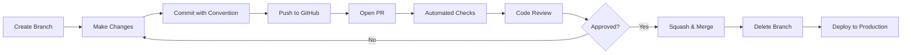

# Git Workflow Strategy for Production

## Executive Summary

**Recommended Model:** **GitHub Flow (Simplified Trunk-Based Development)**

This recommendation is based on:
- Single active contributor (solo/small team project)
- Continuous deployment pattern (Vercel/similar expected)
- No CI/CD currently configured
- E-commerce application requiring quick hotfix capability
- Active development phase with frequent feature additions

---

## Current State Analysis

### Repository Structure
- **Type:** Single-repo (monolithic Next.js application)
- **Tech Stack:** Next.js 16, TypeScript, PostgreSQL, Prisma, Stripe, Cloudinary
- **Hosting Platform:** GitHub (`github.com/bisratjenbere/ethiostore`)
- **Deployment:** Not automated (assumed manual or Vercel)

### Current Branching Pattern
```
main (production)
├── shadow-burglar (feature/worktree branch?)
└── origin/main (remote tracking)
```

### Git History Analysis (Last 16 commits)

**Observed Patterns:**
- ✅ Linear history (no merge commits)
- ✅ Direct commits to `main`
- ❌ **Anti-Pattern:** Inconsistent commit messages (mixed case, no convention)
- ❌ **Anti-Pattern:** Vague messages ("added", "bug fixed")
- ❌ **Anti-Pattern:** No feature branches visible
- ✅ Regular commits (good cadence)
- ❌ No version tags/releases
- ❌ No CI/CD checks

**Commit Message Examples (Current):**
```
added
payment method page and component added
bug related with shipping page is fixed
Cart Is Added
authentication Added
```

**Issues Identified:**
1. No structured commit convention
2. No branch protection on `main`
3. No code review process
4. No automated testing/linting gates
5. Direct pushes to production branch
6. No release versioning
7. Mysterious `shadow-burglar` branch (appears to be git worktree)

### Team Size
- **1 active contributor** (Bisrat)
- **Solo developer** or very small team
- No CODEOWNERS, CONTRIBUTING.md, or PR templates

### Deployment Characteristics
- **7 database migrations** across ~1 month
- **Frequent schema changes** (active development)
- **No downtime tolerance** (e-commerce with Stripe payments)
- Multiple external integrations (Stripe, Cloudinary, Nodemailer)

---

## Recommended Workflow: GitHub Flow

### Why GitHub Flow?

**✅ Matches Your Needs:**
1. **Simple** - Solo developer doesn't need Git Flow complexity
2. **Fast** - Deploy features quickly without release branches
3. **Safe** - PR process adds safety net without slowing you down
4. **Flexible** - Easy to add hotfixes without special branches
5. **Industry Standard** - Works with Vercel, Netlify, GitHub Actions out of the box

**❌ Why NOT Git Flow:**
- Overkill for single developer
- `develop` + `release` branches add unnecessary overhead
- Slower deployment cycle
- Better for scheduled releases (not continuous deployment)

**❌ Why NOT Pure Trunk-Based:**
- No code review opportunity
- Risky for production e-commerce app
- No rollback strategy without PRs

---

## Workflow Implementation

### Branch Structure

```
main (protected, production-ready)
  ├── feature/stripe-webhook-retry
  ├── feature/admin-bulk-product-upload
  ├── bugfix/cart-quantity-validation
  └── hotfix/payment-webhook-timeout
```

**Rules:**
- `main` is **always deployable**
- `main` reflects **production state**
- All work happens in **short-lived feature branches**
- Features merge via **Pull Request only**

---

## Branch Naming Convention

### Format
```
<type>/<ticket-id>-<short-description>
```

### Types
| Type | Purpose | Example |
|------|---------|---------|
| `feature/` | New functionality | `feature/123-product-reviews` |
| `bugfix/` | Bug fixes | `bugfix/456-cart-empty-state` |
| `hotfix/` | Critical production fixes | `hotfix/stripe-webhook-fail` |
| `chore/` | Maintenance (deps, config) | `chore/update-next-16` |
| `docs/` | Documentation only | `docs/api-endpoints` |
| `refactor/` | Code improvements (no behavior change) | `refactor/product-actions` |

### Examples (Good)
```
feature/admin-order-filters
feature/gh-123-product-search
bugfix/checkout-address-validation
hotfix/stripe-timeout
chore/prisma-upgrade-7.2
docs/deployment-guide
refactor/cart-calculations
```

### Examples (Bad)
```
bisrat-feature          ❌ No type prefix
fix                     ❌ Not descriptive
new-stuff               ❌ Vague
shadow-burglar          ❌ Unclear purpose
```

---

## Commit Message Convention

### Use Conventional Commits

**Format:**
```
<type>(<scope>): <subject>

[optional body]

[optional footer]
```

### Types
- `feat`: New feature
- `fix`: Bug fix
- `docs`: Documentation changes
- `style`: Code style (formatting, no logic change)
- `refactor`: Code restructuring
- `perf`: Performance improvements
- `test`: Adding/fixing tests
- `chore`: Maintenance tasks
- `build`: Build system/dependencies
- `ci`: CI/CD configuration

### Examples

**✅ Good:**
```
feat(checkout): add Stripe payment integration

- Integrated Stripe Checkout API
- Added webhook handler for payment events
- Updated order model with payment status

Closes #45
```

```
fix(cart): prevent negative quantity values

Users could decrement cart quantity below zero.
Added validation in updateCartQuantity action.

Fixes #67
```

```
chore(deps): upgrade Next.js to 16.0.8

- Updated next package
- Updated react to 19.2.3
- Tested build process
```

**❌ Bad:**
```
added                       ❌ What did you add?
bug fixed                   ❌ Which bug?
payment method page added   ❌ No type, no scope
Cart Is Added              ❌ Wrong case, no context
```

### Commit Message Rules
1. **Use imperative mood** ("add" not "added")
2. **Don't capitalize** first letter
3. **No period** at end of subject
4. **Subject ≤ 50 chars**, body ≤ 72 chars per line
5. **Reference issues** in footer (`Fixes #123`, `Closes #45`)
6. **Breaking changes** use `BREAKING CHANGE:` in footer

---

## Pull Request Strategy

### PR Workflow



### PR Creation Checklist
```markdown
## Description
Brief description of changes

## Type of Change
- [ ] Feature
- [ ] Bug fix
- [ ] Hotfix
- [ ] Chore

## Testing
- [ ] Tested locally
- [ ] Database migrations run successfully
- [ ] Stripe test mode validated (if payment changes)
- [ ] Email notifications verified (if email changes)

## Database Changes
- [ ] No schema changes
- [ ] Migration included and tested
- [ ] Seed data updated

## Screenshots (if UI changes)

## Breaking Changes
- [ ] None
- [ ] Yes (describe below)
```

### Merge Strategy: **Squash and Merge**

**Why Squash?**
- ✅ Clean linear history on `main`
- ✅ One commit per feature (easier bisect/revert)
- ✅ Hide messy WIP commits
- ✅ Clear release notes

**When to Merge Commit?**
- Never for this project (single contributor)

**When to Rebase?**
- Locally before pushing (optional, for clean PR)
- NOT on `main` (breaks shared history)

---

## Branch Protection Rules

### Configure on GitHub

**Settings → Branches → Add Rule for `main`:**

```yaml
Branch name pattern: main

Protect matching branches:
  ✅ Require a pull request before merging
    ✅ Require approvals: 0 (solo dev)
    ✅ Dismiss stale PR approvals
    ✅ Require review from Code Owners (once added)
  
  ✅ Require status checks to pass before merging
    ✅ Require branches to be up to date
    Status checks (when added):
      - lint
      - type-check
      - build
  
  ✅ Require conversation resolution before merging
  ✅ Do not allow bypassing the above settings
  
  ✅ Restrict pushes that create matching branches
  ⬜ Allow force pushes (NEVER)
  ⬜ Allow deletions (NEVER)
```

**For Solo Developer:**
- Set "Required approvals" to `0` initially
- Still create PRs for **self-review**
- Add CI checks as gates

---

## Release & Hotfix Strategy

### Versioning: Semantic Versioning (SemVer)

**Format:** `v<major>.<minor>.<patch>`

**Examples:**
- `v1.0.0` - Initial production release
- `v1.1.0` - New feature (admin panel)
- `v1.1.1` - Bug fix (cart validation)
- `v2.0.0` - Breaking change (API restructure)

### Release Process

#### 1. Regular Release (Features)

```bash
# 1. Ensure main is clean
git checkout main
git pull origin main

# 2. Create release tag
git tag -a v1.2.0 -m "Release v1.2.0

Features:
- Product search and filtering
- Admin bulk product upload
- Email notifications for orders

Bug Fixes:
- Fixed cart quantity validation
- Resolved Stripe webhook timeout

Database Migrations:
- Added product search indexes
"

# 3. Push tag
git push origin v1.2.0

# 4. Create GitHub Release
# Go to Releases → Draft new release → Select tag → Generate notes
```

#### 2. Hotfix Process (Critical Production Bugs)

**Scenario:** Payment webhook failing in production

```bash
# 1. Create hotfix branch from main
git checkout main
git pull origin main
git checkout -b hotfix/stripe-webhook-timeout

# 2. Fix the bug
# Edit lib/actions/stripe.actions.ts

# 3. Commit with fix type
git add .
git commit -m "fix(payments): increase Stripe webhook timeout to 30s

Production webhooks timing out after 10s.
Increased timeout and added retry logic.

Fixes #234"

# 4. Push and create PR
git push -u origin hotfix/stripe-webhook-timeout

# 5. Create PR with "HOTFIX" label
# 6. Merge immediately after CI passes
# 7. Tag hotfix version
git checkout main
git pull origin main
git tag -a v1.1.1 -m "Hotfix v1.1.1: Stripe webhook timeout"
git push origin v1.1.1

# 8. Deploy to production immediately
```

**Hotfix Rules:**
- ✅ Branch from `main`
- ✅ Merge back to `main`
- ✅ Deploy immediately
- ✅ Tag with patch version
- ✅ Can skip approval if critical (but still create PR for audit)

---

## CI/CD Setup (Recommended)

### GitHub Actions Workflow

Create `.github/workflows/ci.yml`:

```yaml
name: CI

on:
  pull_request:
    branches: [main]
  push:
    branches: [main]

jobs:
  lint:
    runs-on: ubuntu-latest
    steps:
      - uses: actions/checkout@v4
      - uses: actions/setup-node@v4
        with:
          node-version: '20'
          cache: 'npm'
      - run: npm ci
      - run: npm run lint

  type-check:
    runs-on: ubuntu-latest
    steps:
      - uses: actions/checkout@v4
      - uses: actions/setup-node@v4
        with:
          node-version: '20'
          cache: 'npm'
      - run: npm ci
      - run: npx tsc --noEmit

  build:
    runs-on: ubuntu-latest
    steps:
      - uses: actions/checkout@v4
      - uses: actions/setup-node@v4
        with:
          node-version: '20'
          cache: 'npm'
      - run: npm ci
      - run: npm run build
        env:
          DATABASE_URL: ${{ secrets.DATABASE_URL }}
          AUTH_SECRET: ${{ secrets.AUTH_SECRET }}

  migration-check:
    runs-on: ubuntu-latest
    steps:
      - uses: actions/checkout@v4
      - uses: actions/setup-node@v4
        with:
          node-version: '20'
          cache: 'npm'
      - run: npm ci
      - run: npx prisma migrate diff --from-empty --to-schema-datamodel prisma/schema.prisma
```

### Deployment Workflow

**Vercel (Recommended for Next.js):**

1. **Connect GitHub Repo to Vercel**
   - Import project from GitHub
   - Set environment variables
   - Enable automatic deployments

2. **Automatic Deployments:**
   ```
   PR opened → Preview deployment
   PR merged to main → Production deployment
   ```

3. **Environment Variables:**
   - Production: `DATABASE_URL`, `AUTH_SECRET`, `STRIPE_SECRET_KEY`, etc.
   - Preview: Use separate test database/Stripe test keys

---

## Developer Workflow (Day-to-Day)

### Starting a New Feature

```bash
# 1. Update main
git checkout main
git pull origin main

# 2. Create feature branch
git checkout -b feature/product-reviews

# 3. Make changes & commit frequently
git add .
git commit -m "feat(products): add review schema to database"

git add .
git commit -m "feat(products): create review submission form"

git add .
git commit -m "feat(products): display reviews on product page"

# 4. Push branch
git push -u origin feature/product-reviews

# 5. Open PR on GitHub
# 6. Wait for CI checks (once configured)
# 7. Review your own code (yes, really!)
# 8. Squash & merge
# 9. Delete remote branch (automatic)
# 10. Delete local branch
git checkout main
git pull origin main
git branch -d feature/product-reviews
```

### Working on Multiple Features

```bash
# Use git worktree for parallel development
git worktree add ../ethiostore-feature2 -b feature/admin-analytics
cd ../ethiostore-feature2
# Work here without affecting main workspace
```

### Updating Branch with Main Changes

```bash
# On your feature branch
git fetch origin
git rebase origin/main

# Or if you prefer merge
git merge origin/main
```

---

## Handling Common Scenarios

### 1. Need to Fix Bug in Production ASAP

```bash
git checkout main
git pull origin main
git checkout -b hotfix/critical-bug-name

# Fix bug
git commit -m "fix(module): critical bug description

Resolves production issue where...

Fixes #issue-number"

git push -u origin hotfix/critical-bug-name
# Create PR, mark as hotfix, merge immediately
```

### 2. Feature Takes Longer Than Expected

```bash
# Keep feature branch updated with main
git checkout feature/long-running
git fetch origin
git rebase origin/main  # Or merge

# Push updates
git push --force-with-lease origin feature/long-running
```

### 3. Need to Revert a Bad Deploy

```bash
# Option 1: Revert the merge commit
git checkout main
git pull origin main
git revert -m 1 <merge-commit-hash>
git push origin main

# Option 2: Revert via PR (better for audit)
git checkout main
git pull origin main
git checkout -b revert/bad-feature
git revert -m 1 <merge-commit-hash>
git push -u origin revert/bad-feature
# Create PR titled "Revert: Feature X"
```

### 4. Database Migration Failed in Production

```bash
# 1. Create hotfix branch
git checkout -b hotfix/fix-migration

# 2. Fix migration file or create new one
npx prisma migrate dev --name fix_previous_migration

# 3. Test locally
npm run build

# 4. Commit & PR
git add prisma/migrations
git commit -m "fix(db): correct user table migration

Previous migration had syntax error...

Fixes #issue"

# 5. Merge and deploy
# 6. Run migration in production
# npx prisma migrate deploy
```

---

## Git Configuration

### Local Git Config

```bash
# Set up commit message template
git config --global commit.template ~/.gitmessage

# Enable commit signing (optional but recommended)
git config --global user.signingkey <your-gpg-key>
git config --global commit.gpgsign true

# Set default pull strategy
git config --global pull.rebase true

# Set default branch name
git config --global init.defaultBranch main

# Use Conventional Commits
git config --global alias.cz '!npx cz'  # If using commitizen
```

### Commit Message Template

Create `~/.gitmessage`:

```
# <type>(<scope>): <subject>
# |<----  Using a Maximum Of 50 Characters  ---->|

# Explain why this change is being made
# |<----   Try To Limit Each Line to a Maximum Of 72 Characters   ---->|

# Provide links or keys to any relevant tickets, articles or other resources

# --- COMMIT END ---
# Type can be
#    feat     (new feature)
#    fix      (bug fix)
#    refactor (code improvement)
#    style    (formatting, missing semi colons, etc)
#    docs     (changes to documentation)
#    test     (adding or refactoring tests)
#    chore    (maintenance)
#    perf     (performance improvement)
#    build    (build system/dependencies)
#    ci       (CI/CD configuration)
# --------------------
# Remember to:
#    Use imperative mood ("add" not "added")
#    Don't capitalize first letter
#    No dot (.) at the end
#    Separate subject from body with blank line
#    Use body to explain what and why vs. how
```

---

## PR Templates

### Create `.github/pull_request_template.md`

```markdown
## Description
<!-- Brief description of what this PR does -->

## Type of Change
<!-- Mark with 'x' -->
- [ ] 🚀 Feature (new functionality)
- [ ] 🐛 Bug fix (fixes an issue)
- [ ] 🔥 Hotfix (critical production fix)
- [ ] 📝 Documentation
- [ ] 🔨 Chore (maintenance, deps)
- [ ] ♻️  Refactor (code improvement)

## Related Issues
<!-- Link to GitHub issues: Fixes #123, Closes #456 -->

## Changes Made
<!-- Bulleted list of changes -->
- 
- 
- 

## Testing Checklist
- [ ] Tested locally in development
- [ ] TypeScript compiles without errors
- [ ] ESLint passes
- [ ] Build succeeds (`npm run build`)
- [ ] No console errors in browser

## Database Changes
- [ ] No schema changes
- [ ] Migration included and tested locally
- [ ] Seed data updated (if needed)

## External Integration Testing
- [ ] N/A - No external services affected
- [ ] Stripe payment flow tested (test mode)
- [ ] Cloudinary image upload tested
- [ ] Email notifications verified
- [ ] All webhooks tested with Stripe CLI

## Screenshots
<!-- If UI changes, add before/after screenshots -->

## Breaking Changes
- [ ] No breaking changes
- [ ] ⚠️  Yes - See description below

<!-- If breaking changes, describe migration path -->

## Deployment Notes
<!-- Any special steps needed for deployment? -->

## Checklist
- [ ] Code follows project conventions
- [ ] Commits follow Conventional Commits format
- [ ] Self-reviewed my own code
- [ ] Added/updated tests (if applicable)
- [ ] Updated documentation (if needed)
- [ ] No sensitive data (keys, passwords) in code
```

---

## CODEOWNERS File

### Create `.github/CODEOWNERS`

```
# Global ownership
* @bisratjenbere

# Database & Prisma
/prisma/ @bisratjenbere
/lib/actions/ @bisratjenbere

# Authentication
/auth.ts @bisratjenbere
/app/(auth)/ @bisratjenbere

# Payment processing (critical)
/lib/actions/stripe.actions.ts @bisratjenbere
/app/api/webhooks/stripe/ @bisratjenbere

# Admin panel
/app/admin/ @bisratjenbere
/components/admin/ @bisratjenbere

# Documentation
*.md @bisratjenbere
/.kiro/ @bisratjenbere
```

---

## Documentation Files to Create

### 1. `CONTRIBUTING.md`

```markdown
# Contributing to EthioStore

## Getting Started
1. Fork the repository
2. Clone your fork: `git clone https://github.com/YOUR_USERNAME/ethiostore.git`
3. Add upstream remote: `git remote add upstream https://github.com/bisratjenbere/ethiostore.git`

## Development Workflow
1. Create a feature branch: `git checkout -b feature/your-feature-name`
2. Make your changes
3. Commit using Conventional Commits format
4. Push to your fork
5. Open a Pull Request

## Commit Message Format
We use Conventional Commits:

```
feat(scope): add new feature
fix(scope): fix bug
docs(scope): update documentation
chore(scope): maintenance task
```

See [GIT-WORKFLOW-STRATEGY.md](.kiro/GIT-WORKFLOW-STRATEGY.md) for details.

## Code Style
- Run `npm run lint` before committing
- TypeScript strict mode enabled
- Follow existing code patterns

## Testing
- Test locally: `npm run dev`
- Run build: `npm run build`
- Test database migrations: `npx prisma migrate dev`

## Pull Request Guidelines
- Use the PR template
- Link related issues
- Ensure CI passes
- Request review

## Questions?
Open an issue or contact @bisratjenbere
```

---

## Migration Plan: Current → Recommended

### Phase 1: Foundation (Week 1)
1. ✅ **Read this document** - Understand the workflow
2. ✅ **Create PR template** - Copy from above
3. ✅ **Create CONTRIBUTING.md** - Copy from above
4. ✅ **Add CODEOWNERS** - Copy from above
5. ✅ **Configure commit template** - Set up locally
6. 🔄 **Clean up branches** - Delete/document `shadow-burglar`

### Phase 2: Branch Protection (Week 1)
1. ✅ **Enable branch protection** on `main`
   - Require PRs (even for yourself)
   - No force pushes
   - No direct commits
2. ✅ **Create first feature branch** - Test workflow
3. ✅ **Create first PR** - Practice self-review
4. ✅ **Use squash merge** - Verify clean history

### Phase 3: CI/CD (Week 2)
1. ✅ **Create `.github/workflows/ci.yml`**
2. ✅ **Add lint check** to CI
3. ✅ **Add type-check** to CI
4. ✅ **Add build check** to CI
5. ✅ **Require CI to pass** in branch protection

### Phase 4: Deployment (Week 2-3)
1. ✅ **Deploy to Vercel** (or preferred platform)
2. ✅ **Connect GitHub** for auto-deploys
3. ✅ **Set up preview deployments** for PRs
4. ✅ **Configure environment variables**
5. ✅ **Test deployment pipeline**

### Phase 5: Releases (Week 3-4)
1. ✅ **Create first release tag** - `v1.0.0`
2. ✅ **Document release notes** on GitHub
3. ✅ **Establish release cadence** (e.g., weekly)
4. ✅ **Practice hotfix workflow**

---

## Checklist: Workflow Maturity

### Level 1: Basic Safety ✅ (Week 1)
- [ ] Branch protection enabled on `main`
- [ ] PRs required for all changes
- [ ] Commit message convention adopted
- [ ] Branch naming convention in use
- [ ] PR template in place

### Level 2: Automated Quality ⚙️ (Week 2)
- [ ] CI pipeline running (lint, type-check, build)
- [ ] CI checks required for merge
- [ ] Automatic deployments configured
- [ ] Preview deployments for PRs

### Level 3: Professional Operations 🚀 (Week 3-4)
- [ ] Releases tagged with SemVer
- [ ] GitHub Releases with notes
- [ ] Hotfix process documented and tested
- [ ] CONTRIBUTING.md in place
- [ ] Deployment rollback tested

---

## Key Differences: Current vs. Recommended

| Aspect | Current | Recommended |
|--------|---------|-------------|
| **Branch Model** | Direct commits to `main` | Feature branches + PRs |
| **Commit Messages** | Inconsistent, vague | Conventional Commits |
| **Code Review** | None | Self-review via PRs |
| **Branch Protection** | None | Enabled with checks |
| **CI/CD** | None | GitHub Actions + Vercel |
| **Releases** | No tags | Semantic versioning |
| **Hotfixes** | Ad-hoc | Defined process |
| **History** | Clean but risky | Clean AND safe |

---

## Benefits of This Workflow

### For Solo Developer
1. **Safety Net:** PRs prevent accidental main branch corruption
2. **Documentation:** Git history becomes project log
3. **Rollback:** Easy to revert via PR revert
4. **Professionalism:** Shows best practices to future collaborators/employers
5. **Muscle Memory:** Learn industry-standard practices

### For Team Growth
1. **Onboarding:** Clear process for new contributors
2. **Code Review:** Built-in review process
3. **Audit Trail:** Every change has context
4. **Collaboration:** Multiple features in parallel
5. **Trust:** CI ensures code quality

### For Production E-commerce
1. **Stability:** Main is always deployable
2. **Quick Hotfixes:** Clear emergency process
3. **Rollback:** Revert bad deploys easily
4. **Compliance:** Audit trail for transactions
5. **Integration Safety:** Test Stripe/Cloudinary before production

---

## Troubleshooting

### "I accidentally committed to main"

```bash
# If not pushed yet
git reset --soft HEAD~1
git stash
git checkout -b feature/your-feature
git stash pop
git add .
git commit

# If already pushed (requires force push)
# DON'T DO THIS once team grows
```

### "My PR conflicts with main"

```bash
git checkout feature/your-feature
git fetch origin
git rebase origin/main
# Resolve conflicts
git rebase --continue
git push --force-with-lease origin feature/your-feature
```

### "I need to update a PR"

```bash
# Just push more commits to the same branch
git checkout feature/your-feature
# Make changes
git commit -m "fix(scope): address PR feedback"
git push origin feature/your-feature
# PR updates automatically
```

### "CI is failing but code works locally"

```bash
# Run CI commands locally
npm run lint
npx tsc --noEmit
npm run build

# Fix issues
git commit -m "fix(ci): resolve linting errors"
git push
```

---

## Resources

- [GitHub Flow Guide](https://guides.github.com/introduction/flow/)
- [Conventional Commits](https://www.conventionalcommits.org/)
- [Semantic Versioning](https://semver.org/)
- [Git Worktrees](https://git-scm.com/docs/git-worktree)
- [Vercel Git Integration](https://vercel.com/docs/git)
- [GitHub Actions for Next.js](https://github.com/vercel/next.js/blob/canary/examples/with-github-actions/README.md)

---

## Next Steps

**Immediate (Today):**
1. Read this document
2. Decide if you agree with the approach
3. Create `.github/pull_request_template.md`
4. Create `CONTRIBUTING.md`

**This Week:**
1. Enable branch protection on `main`
2. Create your next feature in a branch
3. Open a PR (even if solo developer)
4. Practice squash & merge

**This Month:**
1. Set up GitHub Actions CI
2. Connect to Vercel for auto-deploy
3. Create your first release tag (`v1.0.0`)
4. Document the process

---

**Questions?** Open an issue or update this document as you learn!

---

_Last Updated: 2026-07-14_
_Version: 1.0.0_
_Author: Kiro AI Assistant_
